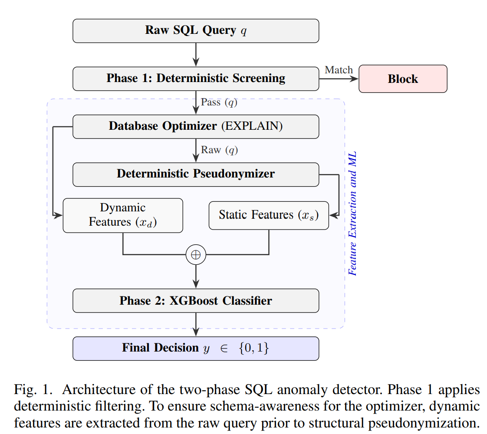

# A Two-Stage Privacy-Aware SQL Anomaly Detector for Inline Database Defense

[](https://example.com/placeholder-link)

> **[A Two-Stage Privacy-Aware SQL Anomaly Detector for Inline Database Defense](https://example.com/placeholder-link)**  
> Thanh-Tan Doan and Hung-Nghiep Tran  
> *Proceedings of the 2026 International Conference on Multimedia Analysis and Pattern Recognition (MAPR)*



## Abstract
Inline database defenses require mechanisms to intercept malicious attacks and performance anomalies. Conventional lexical filters lack awareness of query execution costs, while machine learning models trained on operational logs risk exposing sensitive proprietary data. This paper presents a privacy-aware SQL anomaly detector utilizing a two-phase architecture. The first phase employs deterministic screening to filter explicit SQL injection signatures and tautological constructs. For queries bypassing this phase, dynamic execution plan signals are first generated by the database optimizer. Subsequently, a deterministic pseudonymization protocol masks literal values and schema identifiers for secure telemetry and off-site analysis. The second phase utilizes an eXtreme Gradient Boosting (XGBoost) classifier operating on an 11-dimensional bipartite feature space, combining the dynamic metrics with static structural features extracted from the pseudonymized text. Experimental evaluation on a hybrid dataset of 10,972 queries demonstrates that the proposed classifier achieves an F1 score of 0.9318 and a Matthews Correlation Coefficient of 0.8609. Performance profiling indicates an algorithmic inference latency of 1.471 μs and an integrated pipeline processing time of 2.692 ms. The integration of syntax analysis and execution plan metrics provides accurate anomaly detection within the strict latency constraints required for operational database firewalls. The source code and datasets are available at https://github.com/td-aiops-research-lab/PASAD

## Features
Key contributions of this work include: (1) a two-phase detection pipeline combining deterministic screening with statistical machine learning; (2) a deterministic pseudonymization protocol ensuring structural confidentiality for off-site telemetry and model training without exposing proprietary data; (3) a bipartite feature representation integrating structural metrics with dynamic execution plans; and (4) an empirical evaluation of an XGBoost classifier against conventional baselines under inference latency constraints.

This repository contains the official experimental implementation for the 2026 International Conference on Multimedia Analysis and Pattern Recognition (MAPR) publication.

## Overview

The framework is designed for inline database defenses to intercept SQL injection (SQLi) attacks and execution performance anomalies under strict latency constraints. The architecture is structured into two sequential processing phases:

1. **Phase 1 (Deterministic Screening)**: Employs deterministic rules via regular expression matching to immediately filter explicit SQL injection signatures and tautological constructs.
2. **Phase 2 (Machine Learning)**: Evaluates queries bypassing Phase 1 using an eXtreme Gradient Boosting (XGBoost) classifier. It operates on an 11-dimensional bipartite feature space, combining dynamic metrics extracted from the database optimizer with static structural features derived from a pseudonymized query format.

## 1. Data Synthesis and Ingestion

The dataset construction pipeline generates a hybrid dataset comprising operational baselines and simulated anomalies, ensuring valid execution plans via real-time database optimizer validation.

- `tpch_generator_csv.py` & `tpch_generator_sql.py`: Python utilities to synthesize TPC-H compliant dataset records. These scripts serve as accessible alternatives to the standard C-based `dbgen` tool, allowing researchers to rapidly populate the baseline database required for the optimizer's execution plan estimations.
- `hybrid_sqli_loader.py`: Synthesizes piggybacked SQL injection payloads by appending malicious constructs to structurally valid TPC-H queries.
- `synthetic_generator.py`: Generates execution performance anomalies based on the standard TPC-H relational schema.

A fundamental requirement for both modules is the validation of execution plans using the MySQL `EXPLAIN` command, ensuring that all analyzed queries are syntactically and operationally valid within the target environment.

## 2. Privacy-Aware Feature Engineering

The feature extraction subsystem implements a deterministic pseudonymization protocol to ensure structural confidentiality for off-site telemetry.

- `core_sql_anonymizer.py`: Implements the deterministic pseudonymization protocol. Literal values are masked using standardized tags, and schema identifiers (tables and columns) are hashed using SHA-256 truncated to eight hexadecimal characters. This ensures repeated structural elements yield identical pseudonyms without exposing proprietary schema information.
- `data_anonymizer_aiops.py`: Applies the pseudonymization protocol systematically across the dataset.
- `define_label.py`: Defines the composite labeling criteria based on structural rules (e.g., explicit SQL injection signatures, unauthorized Data Definition Language modifiers) and operational cost limits (e.g., query cost thresholds or unindexed table scans).
- `dataset_setup.py`: Aggregates operational baselines and anomalies, applying the defined labels to construct the final dataset for model training.

### Dataset Availability and Privacy Constraints

To support reproducibility while adhering to strict data privacy requirements, this repository includes the processed dataset: `data/firewall_training_dataset_anonymized.csv`. This dataset is utilized directly by the machine learning classifiers. The raw operational logs (`data/firewall_training_dataset_raw.csv`) originate from internal enterprise database history and contain sensitive proprietary schemas and user data. Consequently, the raw logs cannot be publicly released. The provided anonymized dataset demonstrates the efficacy of the proposed deterministic pseudonymization protocol, allowing researchers to evaluate the model's performance without compromising organizational confidentiality.

## 3. Empirical Feature Extraction Pipeline

The feature representation integrates textual structure with operational cost analysis.

- `feature_extractor.py`: Extracts the 11-dimensional feature vector consisting of 7 static structural features from the pseudonymized query and 4 dynamic execution metrics from the optimizer. It incorporates an automated discovery algorithm utilizing the `information_schema` to dynamically resolve target schemas for execution plan retrieval.
- `pipline_data_collector.py`: Integrates historical ingestion, synthetic generation, and feature extraction into a unified data collection workflow.

## 4. Model Training, Evaluation, and Latency Analysis

The experimental setup evaluates the predictive performance of the machine learning component and quantifies the operational latency of the integrated architecture.

- `training_experiment_core_2phases.py` (and the static variant): Implements data partitioning (Train, Validation, and Test sets), standardizes features using `StandardScaler`, and conducts hyperparameter optimization for the XGBoost model utilizing 5-fold cross-validation.
- `pipeline_evaluator_2phases.py`: Simulates empirical inference to evaluate the integrated two-phase architecture against a single-phase baseline. To measure isolated algorithmic inference latency with microsecond precision, execution times are recorded directly on NumPy arrays, minimizing structural overhead from high-level data processing libraries.

## 5. Installation and Environment Setup

The codebase has been developed and tested on Python 3.12, but it is broadly compatible with Python 3.9+.

1. **Clone the repository:**
   ```bash
   git clone <repository_url>
   cd mapr_for_reviewers
   ```

2. **Set up a virtual environment (Recommended):**
   ```bash
   python -m venv venv
   # On Windows:
   venv\Scripts\activate
   # On macOS/Linux:
   source venv/bin/activate
   ```

3. **Install dependencies:**
   ```bash
   pip install -r requirements.txt
   ```

## 6. Running the Experiments

To facilitate reproducibility, the experimental workflow is divided into two operational modes:

### Mode A: Reproducing Results with the Anonymized Dataset (Recommended)
This mode utilizes the provided `data/firewall_training_dataset_anonymized.csv` dataset out-of-the-box. It does not require a live MySQL database or environment variable configurations.

1. **Model Training (Phase 2):**
   Execute the core training script. This will perform data partitioning, feature scaling, baseline training, and XGBoost hyperparameter optimization using 5-fold cross-validation.
   ```bash
   python training_experiment_core_2phases.py
   ```
   *Outputs:* The trained XGBoost model, standard scaler, and precision-recall metrics will be exported to the `results_2phases/` directory. It also generates the independent `firewall_test_dataset.csv` for the next step.

2. **Holistic Pipeline Evaluation:**
   Run the end-to-end evaluator to simulate and compare the Two-Phase architecture against a Single-Phase baseline.
   ```bash
   python pipeline_evaluator_2phases.py
   ```
   *Outputs:* End-to-end traffic and latency distribution charts, and detailed evaluation metrics, saved in the `results_2phases/` directory.

### Mode B: Full Data Ingestion Pipeline (Requires Live Database)
If you wish to re-run the entire data synthesis and dynamic feature extraction process from scratch:

1. **Database Configuration:**
   Copy the `env-example` file to a new file named `.env` and fill in your MySQL database credentials:
   ```env
   DB_HOST=localhost
   DB_USER=root
   DB_PASSWORD=secret
   DB_NAME=your_database
   ```

2. **Populate Baseline Database:**
   Generate the TPC-H compliant dataset records to serve as the baseline database for the optimizer.
   ```bash
   python tpch_generator_sql.py
   ```
   *(Import the generated `.sql` artifact into your MySQL database before proceeding).*

3. **Data Preprocessing & Labeling:**
   Process the initial raw query logs (`digest_text_with_samples.csv`) to aggregate composite structural labels.
   ```bash
   python dataset_setup.py
   ```
   *Outputs:* `dataset_labeled_final.csv`.

4. **Data Synthesis and Dynamic Feature Extraction:**
   Run the pipeline data collector. This script synthesizes TPC-H performance anomalies and SQL injection payloads, then executes real `EXPLAIN` commands on the database to extract dynamic metrics.
   ```bash
   python pipline_data_collector.py
   ```
   *Outputs:* `data/firewall_training_dataset_raw.csv`.

5. **Data Pseudonymization:**
   To ensure privacy and sanitize sensitive schema definitions from the raw dataset, run the anonymizer:
   ```bash
   python data_anonymizer_aiops.py
   ```
   *Outputs:* `data/firewall_training_dataset_anonymized.csv` (which can now be used in Mode A).

## Conclusion

This repository provides a reproducible implementation of the proposed two-phase SQL anomaly detection pipeline. The codebase demonstrates the integration of deterministic screening, privacy-aware pseudonymization, and optimizer-aware feature extraction to identify anomalous database operations while adhering to the latency constraints required by inline security interceptors.

## How to Cite

If you utilize this methodology or the associated hybrid dataset in your research, please cite the original publication:

Thanh-Tan Doan and Hung-Nghiep Tran. [A Two-Stage Privacy-Aware SQL Anomaly Detector for Inline Database Defense](https://example.com/placeholder-link). MAPR, 2026. doi: [placeholder-doi].

```bibtex
@inproceedings{mapr2026sqlfirewall,
  title={A Two-Stage Privacy-Aware SQL Anomaly Detector for Inline Database Defense},
  author={Thanh-Tan Doan and Hung-Nghiep Tran},
  booktitle={Proceedings of the 2026 International Conference on Multimedia Analysis and Pattern Recognition (MAPR)},
  year={2026},
  doi={[placeholder-doi]},
  url={[placeholder-link]}
}
```
